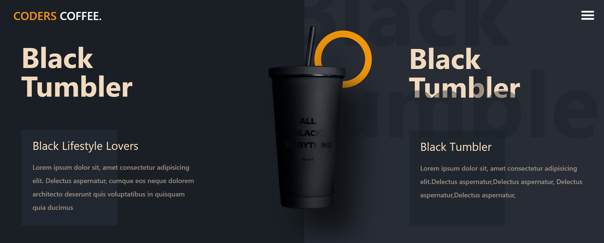

<div align="center">
  <a href="https://coder-coffe-cm.netlify.app/" target="_blanck"></a>
  <h3 align="center">Coders Coffee</h3>
</div>

## <br /> 📋 <a name="table">Summary</a>

- ✨ [Introduction](#introduction)
- 🛠 [Technology Used](#tech-stack)
- 🚀 [Launch App](#launch-app)
- 🎨 [Styling](#style)

## <br /> <a name="introduction">✨ Introduction</a>

**[ENG]** Complete Responsive Coffee shop Website using ReactJS and Tailwind CSS. Animated with Framer motion and react-tilt  

**[FR]** Site Web entièrement réactif pour un café utilisant ReactJS et Tailwind CSS. Animé avec Framer motion et react-tilt

## <br /> <a name="tech-stack">🛠 Technology Used</a>

- [TailwindCSS](https://tailwindcss.com/docs/installation)

- [react-icon](https://www.npmjs.com/package/react-icons)
Include popular icons in your React projects easily with react-icons, which utilizes ES6 imports that allows you to include only the icons that your project is using.

- [react-tilt](https://www.npmjs.com/package/react-tilt?activeTab=readme)
A tiny request Animation Frame powered 60 fps light weight parallax hover tilt effect for ReactJS.

- [framer-motion](https://www.npmjs.com/package/framer-motion)
Framer Motion is an open source, production-ready library that’s designed for all creative developers.


## <br /> <a name="launch-app">🚀 Launch App</a>

<br/>**Cloning the Repository**

```bash
git clone {git remote URL}
```

<br/>**installation**

> After cloning the repository, run the command `npm install` to install the project's dependencies.

> Once the dependencies are installed, start the project with the command `npm run dev`.

## <br /> <a name="style">🎨 Styling</a>

Global styling are defined using TailwindCSS in the tailwind.config.js file.

````
theme: {
    extend: {
      colors: {
        primary: "#f19509",
        primaryDark: "#e86f00",
        lightOrange: "#f1dabf",
        darkGray: "#1a1f25",
        lightGray: "#272c35",
      },
      container: {
        center: true,
        padding: {
          DEFAULT: "1rem",
          sm: "2rem",
        },
      },
      screens: {
        vsm: "425px",
      }
    },
  },
````
